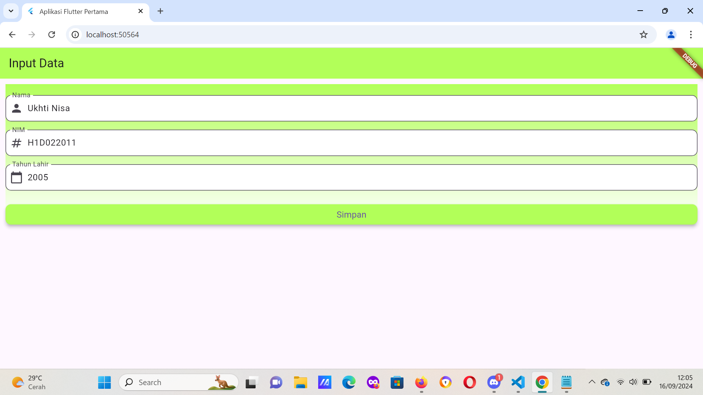
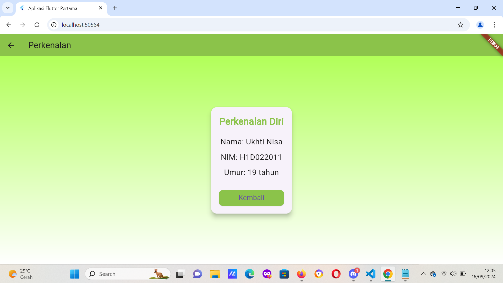

Nama : Ukhti Nisa
NIM : H1D022011
SHIFT Baru : A

Berikut adalah penjelasan detail dari proses passing data dari form menuju ke tampilan:
1. Membuat Formulir Input di Halaman Pertama (FormData)
Pada halaman pertama (FormData), ada tiga input TextField yang memungkinkan pengguna untuk memasukkan Nama, NIM, dan Tahun Lahir. Setiap input ini dikontrol oleh TextEditingController yang digunakan untuk mengambil nilai yang dimasukkan oleh pengguna.

2. Mengambil Data dari TextField
Ketika tombol Simpan diklik, aplikasi akan mengambil nilai dari TextField melalui controller. Pada kode ini, nilai dari masing-masing input diambil sebagai berikut:
String nama = _namaController.text; unuk Menyimpan nilai yang dimasukkan pada kolom Nama.
String nim = _nimController.text; untuk Menyimpan nilai yang dimasukkan pada kolom NIM.
int tahun = int.parse(_tahunController.text); untuk Menyimpan nilai yang dimasukkan pada kolom Tahun Lahir (yang kemudian dikonversi menjadi integer).

3. Mengirimkan Data ke Halaman Lain (TampilData)
Setelah data diambil dari TextField, aplikasi perlu mengirimkan data tersebut ke halaman tujuan (TampilData). Ini dilakukan dengan menggunakan Navigator.push dan MaterialPageRoute di Flutter.
Navigator.of(context).push(
  MaterialPageRoute(
    builder: (context) => TampilData(
      nama: nama,
      nim: nim,
      tahun: tahun,
    ),
  ),
);
- Navigator.push: Digunakan untuk navigasi ke halaman lain.
- MaterialPageRoute: Membuat route (rute) baru menuju halaman tujuan (TampilData).
- TampilData(nama: nama, nim: nim, tahun: tahun): Data yang telah diambil dari input pengguna dikirim sebagai parameter ke halaman TampilData.
4. Menerima Data di Halaman Tujuan (TampilData)

Pada halaman tujuan (TampilData), data yang dikirim dari halaman sebelumnya diterima melalui constructor. Hal ini memungkinkan halaman tujuan untuk menampilkan data tersebut.
class TampilData extends StatelessWidget {
  final String nama; untuk nilai nama dari halaman FormData
  final String nim; untuk mnerima nilai NIM
  final int tahun; untuk menerima nilai tahun lahir

  const TampilData({
    Key? key,
    required this.nama,
    required this.nim,
    required this.tahun,
  }) : super(key: key);
}
Data tersebut diterima melalui constructor TampilData dan disimpan dalam variabel lokal di dalam kelas.

5. Menampilkan Data di Halaman Tujuan
Setelah data diterima di halaman TampilData, Anda dapat menampilkan data tersebut menggunakan widget Flutter seperti Text. pada bagian ini, nilai nama, nim, dan umur (yang dihitung dari tahun lahir) ditampilkan menggunakan widget Text. Data yang dikirim dari halaman pertama telah berhasil di-passing dan ditampilkan di halaman ini.

untuk lebih singkatnya berikut adalah Alur Passing Data:
- Pengguna memasukkan data ke dalam form di halaman FormData menggunakan widget TextField.
- Saat tombol Simpan diklik, data diambil dari controller masing-masing TextField.
- Navigator.push digunakan untuk berpindah ke halaman TampilData sambil mengirimkan data tersebut.
- Di halaman TampilData, data diterima melalui parameter constructor.
- Data ditampilkan di halaman TampilData menggunakan widget Text.
- 
## Screenshot

